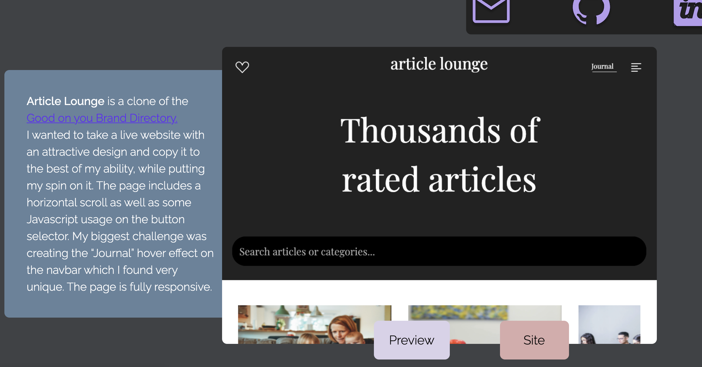

# README
# My Portfolio Page

Have a look at the code to my portfolio page, a single flowing page.


This application was built with
```
Ruby on Rails, Javascript, HTML & CSS.
```

## Live site:

[Portfolio Page](https://thomastempledev.herokuapp.com/)

## Setup

If you would like to look at the code then clone the GitHub repository and change directory into `the-real-portfolio`:
```
gh repo clone Tom-Tee/the-real-portfolio
```

You will also need Bundler installed:
```
bundle install
```
This will install the gems needed to run the program correctly.

## Navigating the application

You will see the beginning to the page where you can automatically jump to certain parts in the page. There is also a *theme selector* on the right:


Have a scroll down and you can see my projects.

Here are just a couple:

## lumina


Each project has a modal to preview content and a link to the project.


## article lounge



## My skills


The site is fully responsive for different desktop sizes.

Try it out!