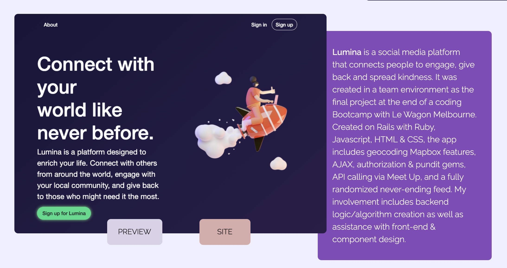
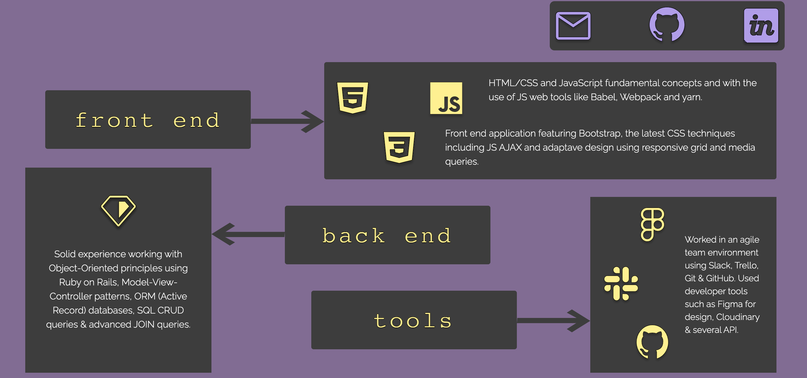

# README
# My Portfolio Page

Have a look at the code to my portfolio page. I decided to make a single page with all my recent projects in them. I wanted to be a little different with the design and give it personality. 


This application was built with
```
Ruby on Rails, Javascript, HTML & CSS.
```

## Live site:

[Portfolio Page](https:/www.thomastemple.dev/)

## Setup

If you would like to look at the code then clone the GitHub repository and change directory into `lumina`:
```
gh repo clone Tom-Tee/the-real-portfolio
```

You will also need Bundler installed:
```
bundle install
```
This will install the gems needed to run the program correctly.

## Navigating the application

You will see the beginning to the page where you can automatically jump to certain parts in the page. There is also a *theme selector* on the right:


Have a scroll down and you can see my projects.

Here are just a couple:
##lumina



##article lounge


Have a look at my skills section too;



The site is also fully responsive for different desktop sizes.


